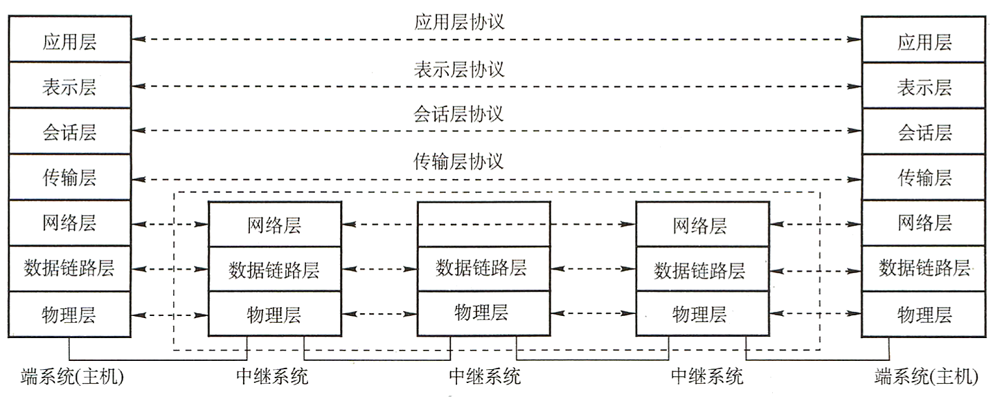

# 1.1 计算机网络概述

## 1.1.1 计算机网络的概念

计算机网络是一个将分散的、具有独立功能的**计算机系统**，通过**通信设备**与**线路**连接起来，由功能完善的软件实现**资源共享**和**信息传递**的系统。简言之，计算机网络就是一些互连的、自治的计算机系统的集合。

**关键词**
* 计算机网络是互联的、自治的计算机集合
* 互联：互联互通，通信链路
* 自治：无主从关系。

## 1.1.2 计算机网络的组成

### 组成部分的角度

一个完整的计算机网络主要由硬件、软件、协议三大组成部分，缺一不可。
* **硬件**：主要由主机 (也叫端系统)、通信链路 (如双绞线、光纤)、交换设备 (如路由器、交换机等) 和通信处理机 (如网卡) 等组成 。
* **软件**：主要包括各种实现资源共享的软件、方便用户使用的各种工具软件，如网络操作系统、邮件收发程序、FTP程序、聊天程序等。 软件部分多属于应用层。
* **协议**：是计算机网络的核心，如同交通规则制约汽车驾驶一样，协议规定了网络传输数据时所遵循的规范。

### 工作方式的角度

* **边缘部分**：由所有连接在因特网上、可供用户直接使用的主机组成。边缘部分的设备基于核心部分所提供的服务可以实现端到端的通信，从而进一步实现资源交换或共享。端到端通信通常有以下方式：
	* [C/S方式](第6章%20应用层.md#6.1.1%20客户/服务器模型(C/S))、B/S方式：客户端/浏览器、服务端
	* [P2P方式](第6章%20应用层.md#6.1.2%20对等模型(P2P))：peer to peer，端到端方式
* **核心部分**：由大量的网络和连接这些网络的路由器组成，负责向边缘部分的主机提供连通性服务，保证主机间的正常通信。

### 功能组成的角度

* **通信子网**：由各种传输介质、通信设备和相应的网络协议组成，它使网络具有数据传输、交换、控制和存储的能力，实现联网计算机之间的数据通信。
* **资源子网**：是实现资源共享功能的设备及其软件的集合，向网络用户提供共享其他计算机上的硬件资源、软件资源和数据资源的服务。

## 1.1.3 计算机网络的功能

* **数据通信**：它是计算机网络最基本和最重要的功能，用来实现联网计算机之间的各种信息的传输，并实现将分散在不同地理位置的计算机联系起来，进行统一的调配、控制和管理。比如，文件传输、电子邮件等应用，离开了计算机网络将无法实现。
* **资源共享**：可以是软件共享、数据共享，也可以是硬件共享。使计算机网络中的资源互通有无、分工协作，从而极大地提高硬件资源、软件资源和数据资源的利用率。
* **分布式处理**：当计算机网络中的某个计算机系统负荷过重时，可以将其处理的某个复杂任务分配给网络中的其他计算机系统，从而利用空闲计算机资源以提高整个系统的利用率。
* **提高可靠性**：计算机网络中的各台计算机可以通过网络互为替代机。
* **负载均衡**：将工作任务均衡地分配给计算机网络中的各台计算机。

除了以上几大主要功能，计算机网络还可以实现电子化办公与服务、远程教育、娱乐等功能，满足了社会的需求，方便了人们学习、工作和生活，具有巨大的经济效益。

## 1.1.4 计算机网络的分类

### 按分布范围分类

* **广域网WAN**：Wide Area Network，广域网的任务是提供长距离通信，运送主机所发送的数据，其覆盖范围通常为几十到几千千米的区域，因而有时也称为远程网。广域网是因特网的核心部分。连接广域网的各结点交换机的链路一般都是高速链路，具有较大的通信容量。
* **城域网MAN**：Metropolitan Area Network，城域网的覆盖范围可以跨越几个街区甚至整个城市，覆盖范围约为5~50km。城域网大多采用以太网技术，因此有时也常并入局域网的范围进行讨论。
* **局域网LAN**：Local Area Network，局域网一般用微机或工作站通过高速线路相连，覆盖范围约10m ~10km。局域网在计算机配置的数量上没有太多的限制，少的可以只有两台，多的可达几百台。传统上，<u>局域网使用广播技术，而广域网则使用交换技术</u>。
* **个人区域网PAN**：Personal Area Network，个人区域网是在个人工作的地方将消费电子设备 (如平板电脑、智能手机等) 用无线技术连接起来的网络，也常称为无线个人区域网WPAN，其范围大约在10m。

注意：若中央处理器之间的距离非常近 (如仅1m的数量级或甚至更小)，则一般就称之为**多处理器系统**，而不称它为计算机网络。

### 按传输技术分类

* **广播式网络** - 所有联网计算机都共享一个公共通信信道。当一台计算机利用共享通信信道发送报文分组时，所有其他的计算机都会 “收听” 到这个分组。接收到该分组的计算机将通过检查目的地址来决定是否接收该分组。
	* <u>局域网基本上都采用广播式通信技术，广域网中的无线、卫星通信网络也采用广播式通信技术。</u>
* **点对点网络** - 每条物理线路连接一对计算机。如果通信的两台主机之间没有直接连接的线路，那它们之间的分组传输就要通过中间结点的接收、存储和转发，直至目的结点。

是否采用分组存储转发与路由选择机制是点对点式网络与广播式网络的重要区别，广域网基本都属于点对点网络。

### 按拓扑结构分类

**网络拓扑结构**是指通过网中结点 (路由器、主机等) 与通信线路 (网线) 之间的几何关系 (如总线形、环形) 表示的网络结构，主要是指通信子网的拓扑结构。按网络的拓扑结构，主要分为星形、总线形、环形和网状形网络等。星形、总线形和环形网络多用于局域网，网状形网络多用于广域网：
* **星形网络** - 每个终端或计算机都以单独的线路与中央设备相连。中央设备早期是计算机，现在一般是交换机或路由器。星形网络便于集中控制和管理，因为端用户之间的通信必须经过中央设备。缺点是成本高、中心结点对故障敏感。
* **总线形网络** - 用单根传输线把计算机连接起来。总线形网络的优点是建网容易、增减结点方便、节省线路。缺点是重负载时通信效率不高、总线任一处对故障敏感。
* **环形网络** - 所有计算机接口设备连接成一个环。环形网络最典型的例子便是令牌环局域网。环可以是单环，也可以是双环，环中信号是单向传输的。
* **网状形网络** - 一般情况下，每个结点至少有两条路径与其他结点相连，多用在广域网中。有规则型和非规则型两种。其优点是可靠性高，缺点是控制复杂、线路成本高。
以上四种基本的网络拓扑结构可以互连组织成为更复杂的网络。

### 按使用者分类

* **公用网**：它是指电信公司出资建造的大型网络。“公用” 的意思就是所有愿意按电信公司的规定交纳费用的人都可以使用这种网络，因此也可称为公众网。
* **专用网**：它是某个部门为本单位的特殊业务的需要而建造的网络。这种网络不向本单位以外的人提供服务。例如铁路、电力、军队等部门的专用网。

### 按交换技术分类

交换技术是指主机之间、通信设备之间或主机与通信设备之间为交换信息所采用的数据格式和交换装置的方式。按交换技术可将网络分为：
* [**电路交换**](第2章%20物理层.md#电路交换)：在源结点和目的结点之间建立一条专用的通路用于传送数据，包括建立连接、传输数据和断开连接三个阶段。最典型的电路交换网是传统电话网络。
	* **特点**：整个报文的比特流连续地从源点直达终点，好像在一个管道中传送。
* [**报文交换**](第2章%20物理层.md#报文交换)：将用户数据加上源地址、目的地址、校验码等辅助信息，然后封装成报文。整个报文传送到相邻结点，全部存储下来后，再转发给下一个结点，重复这一过程直到到达目的结点。每个报文可以单独选择到达目的结点的路径。报文交换网络也称为<u>存储-转发网络</u>。
	* **特点**：整个报文先传送到相邻结点，全部存储下来后查找转发表，转发到下一个结点。
* [**分组交换**](第2章%20物理层.md#分组交换)：也称为包交换网络。其原理是将数据分成较短的固定长度的数据块，在每个数据块中加上目的地址、源地址等辅助信息组成分组(包)，<u>以存储-转发方式传输</u>。
	* **特点**：单个分组(这只是整个报文的一部分)传送到相邻结点，存储下来后查找转发表，转发到下一个结点。

### 按传输介质分类

传输介质可以分为有线和无线两大类，故可以分为有线网络和无线网络：
* **有线网络** - 又分为双绞线网络、同轴电缆网络等。
* **无线网络** - 又可分为蓝牙、微波、无线电等类型。

## ~~1.1.5 计算机网络的标准化工作~~

### 标准化分类

计算机网络的标准化对计算机网络的发展和推广起到了极为重要的作用。

* **法定标准** - 由权威机构制定的正式的、合法的标准：OSI
* **事实标准** - 某些公司的产品在竞争中占据了主流，时间长了，这些产品的协议和技术就成了标准：TCP/IP

### RFC及其发展为因特网标准的四个阶段

各种RFC之间的关系

因特网的所有标准都以RFC ( Requests For Comments 因特网标准的形式) 的形式在因特网上发布。但并非每个RFC都是因特网标准，RFC要上升为因特网正式标准需经过以下四个阶段：

- **因特网草案 (Internet Draft)** - 这个阶段还不是RFC文档。
- **建议标准 (Proposed Standard)** - 从这个阶段开始就成为RFC文档。
- **草案标准 (Draft Standard)**
- **因特网标准 (lntemet Standard)**

此外，还有实验的RFC和提供信息的RFC。

### 相关组织

在国际上，有众多的标准化组织负责制定、实施相关网络标准。主要有以下几种：

* **国际标准化组织 (ISO)** - 制定的主要网络标准或规范有OSI参考模型、HDLC等。
* 国际电信联盟(ITU)- 其前身为国际电话电报咨询委员会(CCITT)，其下属机构ITU-T制定了大量有关远程通信的标准。
* 国际电气电子工程师协会(IEEE) - 世界上最大的专业技术团体，由计算机和工程学专业人士组成。IEEE在通信领域最著名的研究成果是802标准。
* Internet工程任务组 (IETF) - 负责因特网相关标准的制定RFC。

## 1.1.6 计算机网络的性能指标
> 性能指标从不同的方面度量计算机网络的性能。
 
### 速率

* **速率**：是指主机在单位时间内从信道一段传送到另一端的数据量，也称为**数据率**或**比特率**，单位是 b/s (比特每秒，或bit/s，有时也写为bps)。当数据率较高时，就可以用 kb/s、Mb/s 或 Gb/s 等来表示。在计算机网络中，通常把最高数据率称为“**带宽**”。
* 速率vs存储容量
	* 速率：b/s→kb/s→Mb/s→Gb/s→Tb/s，相邻单位之间的换算关系为$10^{3}$（个人助记：计算速率时经常要用到频率中的MHz，频率肯定是和$2^{10}$无关的）
	* 存储容量：B→KB→MB→GB→TB，相邻单位之间的换算关系为$2^{10}$

### 带宽

* 当作为频带宽度的度量时，**带宽**指信号所包含的各种不同频率成分所占据的频率范围，即最高频率与最低频率之差，单位是赫兹(Hz)。
* 当作为通信链路传输数据的度量时，**带宽**指链路上每秒能传输的比特数，用来表示网络中某通道传送数据的能力，即信道能通过的“最高数据率”，单位是 “比特每秒” (b/s)。

### 吞吐量

* **吞吐量**：表示在单位时间内通过某个网络 (或信道、接口) 的数据量，单位 b/s、kb/s、Mb/s等
* 区别于链路上的最大可用带宽，常用吞吐量表示一个网络的实际带宽

---
### 时延

* **时延**：是指将数据从网络 的一端传送到另一端所需要花费的时间，也叫**延迟**或**迟延**，单位是秒。
* 时延由四个部分构成：<u>发送时延、传播时延、处理时延和排队时延</u>。数据在网络中经历的总时延就是以上四种时延之和：$\text{总时延}=\text{发送时延}+\text{传播时延}+\text{处理时延}+\text{排队时延}$ 
	* **发送时延**：结点将分组的所有比特推向（传输）链路所需的时间，也就是从发送分组的第一个比特算起，到该分组的最后一个比特发送完毕所需的时间，因此也称为**传输时延**。发送时延计算公式：$\text{发送时延} = \dfrac{\text{数据长度}}{\text{信道宽度}}$
	* **传播时延**：电磁波在信道中传播一定的距离需要花费的时间，也就是一个比特从链路一端到另一端传播所需的时间。传播时延计算公式：$\text{传播时延}=\dfrac{\text{信道长度}}{\text{电磁波在信道上的传播速率}}$
	* **排队时延**：分组在进入路由器后要先在输入队列中排队等待处理。在路由器确定了转发端口后，还要在输出队列中排队等待转发，这就产生了排队时延。排队时延取决于等待队列中分组的数量与端口的发送速率。
	* **处理时延**：数据在交换结点为存储转发而进行的一些必要的处理所花费的时间。例如，分析分组的首部、从分组中提取数据部分、进行差错检验或查找适当的路由等。处理时延取决于路由器的计算能力以及通信协议的复杂程度。

### 时延带宽积

* **时延带宽积**：传播时延$\times$带宽，结果上等于第一个比特到达接收方时发送方已发送的比特数量，是线路中能容纳的最大比特数量，因此又被称为以比特为单位的链路长度

### 往返时延

* **往返时延RTT**：Round-Trip Time，表示从发送方发送数据开始，到发送方收到来自接收方的确认 (接收端收到数据后立即发送确认)所经历的时间。
* RTT包括：往返传播时延(传播时延×2)+末端处理时间
* RTT越大，在收到确认之前可以发送的数据越多

### 利用率

* **信道利用率**：$\dfrac{\text{有数据通过的时间}}{\text{(有+无)数据通过的时间}}$
* **网络利用率**：信道利用率加权平均值
* 网络利用率越高，时延越大。网络当前时延 $D=\dfrac{D_{0}}{1-U}$，其中 $D_{0}$ 为网络空闲时的时延，$U$ 为网络利用率

## 丢包率

* **丢包率**：即分组丢失率，是指一定时间范围内，传输过程中丢失的分组数量与总分组数量的比率。
* 丢包率具体可分为接口丢包率、结点丢包率、链路丢包率、路径丢包率、网络丢包率等
* 分组丢失主要有两种情况
	* 分组在传输过程中出现误码，被结点丢弃
	* 分组到达一台队列已满的分组交换机时被丢弃，在通信量较大时就有可能造成网络拥塞

## 1.1.7 本节习题精选

**选择题**：[题目](4%20计算机网络/王道计算机网络.pdf#page=20&selection=34,0,39,1)、[答案](4%20计算机网络/王道计算机网络.pdf#page=22&selection=153,0,158,1)

**综合题**：[题目](4%20计算机网络/王道计算机网络.pdf#page=21&selection=314,0,319,2)、[答案](4%20计算机网络/王道计算机网络.pdf#page=23&selection=683,0,689,1)

# 1.2 计算机网络体系结构与参考模型

## 1.2.1 计算机网络分层结构

两个系统中实体间的通信是一个很复杂的过程，为了降低协议设计和调试过程的复杂性，也为了便于对网络进行研究、实现和维护，促进标准化工作，通常对计算机网络的体系结构以分层的方式进行建模 。

我们把计算机网络的各层及其协议的集合称为网络的**体系结构** 。计算机网络的体系结构就是这个计算机网络及其所应完成的功能的精确定义，它是计算机网络中的层次、各层的协议以及层间接口的集合。

### 分层基本原则

计算机网络的体系结构通常都具有可分层的特性，将复杂的大系统分成若干较容易实现的层次。

* 各层之间相互独立，每层只实现一种相对独立的功能。
* 每层之间界面自然清晰，易于理解，相互交流尽可能少。
* 各层功能的精确定义独立于具体的实现方法，每层都采用最合适的技术来实现。
* 保持下层对上层的独立性，**上层单向使用下层提供的服务**。
* 整个分层结构应该能促进标准化工作。

由于分层后各层之间相对独立，灵活性好，因而分层的体系结构易于更新 (替换单个模块)，易于调试，易于交流，易于抽象，易于标准化。
但层次越多，有些功能在不同层中难免重复出现，产生了额外的开销，整体运行效率就越低。而层次越少，就会使每一层的协议太复杂。因此，在分层时应考虑层次的清晰程度与运行效率间的折中、层次数量的折中。

### 分层结构

在计算机网络的分层结构中，第 $n$ 层中的活动元素通常称为 $n$ **层实体**。 $n$ 层实体实现的服务为 $n+1$ 层所利用。在这种情况下， $n$ 层被称为服务提供者， $n+1$ 层是服务用户。每一层还有自己传送的数据单位，其名称、大小、含义也各有不同。

在计算机网络体系结构的各个层次中，每一个报文都分为两个部分，一个是数据部分，也就是SDU， 另外一部分是控制信息部分，也就是PCI， 它们共同组成PDU。
* **服务数据单元(SDU)**：Service Data Unit，为完成用户所要求的功能而应传送的数据。第 $n$ 层的服务数据单元记为 n-SDU。
* **协议控制信息(PCI)**：Protocol Control Information，控制协议操作的信息。第 $n$ 层的协议控制信息记为 n-PCI。
* **协议数据单元(PDU)**：Protocol Data Unit，对等层次之间传送的数据单位称为该层的PDU。第 $n$ 层的协议数据单元记为 n-PDU。
	* 在实际的网络中，每层的协议数据单元都有一个通俗的名称，如物理层的PDU叫比特，链路层的PDU叫帧，网络层的PDU叫分组，传输层的PDU叫报文。
* 网络各层数据单元的联系：在各层间传输数据时，把从第 $n+1$ 层收到的PDU作为第 $n$ 层的SDU，加上第 $n$ 层的PCI，就变成了第 $n$ 层的PDU，交给第 $n-1$ 层后作为SDU发送，接收方接收时做相反的处理，故可知三者的关系为 `n-SDU + n-PCI = n-PDU = (n-1)-SDU`。 #考前记一记 

**层次结构的含义**
* 第 $n$ 层的实体不仅要使用第 $n-1$ 层的服务，实现自身定义的功能，还要向第 $n+1$ 层提供本层的服务，该服务是第 $n$ 层及其下面各层提供的服务总和。
* 最低层只提供服务，是整个层次结构的基础；中间各层既是下一层的服务使用者，又是上一层的服务提供者；最高层面向用户提供服务。
* 最低层只提供服务，是整个层次结构的基础；中间各层既是下一层的服务使用者，又是上一层的服务提供者；最高层面向用户提供服务。
* 两个主机通信时，对等层在逻辑上有一条直接信道，表现为不经过下层就把信息传送到对方。

## 1.2.2 计算机网络层次相关术语

### 实体

* **实体**：任何可发送或接受信息的硬件或软件进程
* **对等实体**：收发双方相同层次中的实体

### 协议
> 协议是水平的

* **协议**：协议是为了实现网络中的数据交换而建立的规则或约定，用来描述对等实体之间信息交互的过程。协议由语法、语义和同步三部分组成：
	* **语法**：规定了传输数据的格式。
	* **语义**：规定了所要完成的功能，即需要发出何种控制信息、完成何种动作以及做出何种应答。
	* **同步**：规定了执行各种操作的条件、时序关系等，即事件实现顺序的详细说明。

### 接口

* **接口**：是同一结点内相邻两层间交换信息的连接点，是一个系统内部的规定。每一层只能为紧邻的层次之间定义接口，不能跨层定义接口。
* **服务访问点SAP**：在典型的接口上，同一结点相邻两层的实体通过 服务访问点 (Service Access Point, SAP) 进行交互。服务是通过服务访问点SAP提供给上层使用的，第 $n$ 层的SAP就是第 $n+1$ 层可以访问第 $n$ 层服务的地方。每个SAP都有一个能够标识它的地址。服务访问点SAP是一个抽象的概念，它实际上就是一个逻辑接口(类似于邮政信箱)，但和通常所说的两个设备之间的硬件接口是很不一样的。

### 服务
> 服务是<u>垂直的</u>。

* **服务**：服务可以理解为网络各层所提供的功能调用，有下层向紧邻的上层通过层间的接口提供。
* 上层需要通过与下层交换相应命令来调用下层服务，这些命令被称为**服务原语**。服务原语包含以下四种类型：
	- **请求(Request)** ：由服务用户发往服务提供者，请求完成某项工作。
	- **指示(Indication)** ：由服务提供者发往服务用户，指示用户做某件事。
	- **响应(Response)** ：由服务用户发往服务提供者，作为对指示的响应。
	- **证实(Conforτnation)** ：由服务提供者发往服务用户，作为对请求的证实。
* 这四类原语用于不同的功能，如建立连接、传输数据和断开连接等。有应答服务包括全部四类原语，而无应答服务则只有请求和指示两个原语。

#### 计算机网络所提供服务的分类

**面向连接服务与无连接服务**
* **面向连接服务** - 通信前双方必须先建立连接，分配相应的资源(如缓冲区)，以保证通信能正常进行，传输结束后释放连接和所占用的资源。因此这种服务可以分为连接建立、数据传输和连接释放这三个阶段。例如 TCP 就是一种面向连接服务的协议。
* **无连接服务** - 通信前双方不需要先建立连接，需要发送数据时就直接发送，把每个带有目的地址的包(报文分组)传送到线路上，由系统选定路线进行传输，是一种不可靠的服务。这种服务常被描述为 “尽最大努力交付” ，并不保证通信的可靠性。例如 IP、UDP 就是一种无连接服务的协议。

**可靠服务和不可靠服务**
* **可靠服务** - 是指网络具有纠错、检错、应答机制，能保证数据正确、可靠地传送到目的地。
* **不可靠服务** - 是指网络只是尽量正确、可靠地传送，但不能保证数据正确、可靠地传送到目的地，是一种尽力而为的服务。
	* 对于提供不可靠服务的网络，其网络的正确性、可靠性就要由应用或用户来保障。

**有应答服务和无应答服务**
* **有应答服务** - 是指接收方在收到数据后向发送方给出相应的应答，该应答由传输系统内部自动实现，而不是由用户实现。所发送的应答可以是肯定应答，也可以是否定应答，通常在接收到的数据有错误时发送否定应答。例如，文件传输服务就是一种有应答服务。
* **无应答服务** - 是指接收方收到数据后不自动给出应答。若需要应答，则由高层实现。例如WWW服务，客户端收到服务器发送的页面文件后不给出应答。

### 协议/接口/服务之间的关系

## 1.2.3 ISO/OSI参考模型和TCP/IP模型

### 7层OSI参考模型

国际标准化组织 (ISO) 于1984年提出的网络体系结构模型，称为**开放系统互联参考模型 (OSI/RM)** ，通常简称为**OSI参考模型** (理论成功，市场失败)。OSI有七层，自下而上依次为<u>物理层、数据链路层、网络层、运输层、会话层、表示层、应用层</u>。<!--物联网淑惠试用-->**低三层统称为通信子网**，它是为了联网而附加上去的通信设备，完成数据的传输功能；**高三层统称为资源子网**，它相当于计算机系统，完成数据的处理等功能。运输层承上启下。
#### OSI层次结构
#考前记一记 
上四层端到端，下三层点对点

* [物理层](#物理层)：解决使用何种信号来传输物理比特的问题，在物理媒体上为数据端设备透明的传输原始比特流。传输单位是**比特**。
* [数据链路层](#数据链路层)：解决分组在一个网络内的传输问题，将网络层传下来的IP数据报组装成帧。传输单位是**帧**。
* [网络层](#网络层)：解决分组在多个网络之间的传输问题，把网络层的协议数据单元 (分组) 从源端传到目的端，提供主机之间的逻辑通信。传输单位是**数据报或分组**。
* [传输层](#传输层)：解决进程之间基于网络的通信问题，提供主机间两个进程的通信，即端到端的通信。传输单位是**报文段(TCP)或用户数据报 (UDP)**
* [会话层](#会话层)：解决进程之间的会话问题，向表示层实体/用户进程提供建立连接，并在连接上有序地传输数据。这是会话，也称为**建立同步(SYN)**
* [表示层](#表示层)：解决通信双方交换信息的表示方式，即语法和语义
* [应用层](#应用层)：所有能和用户交互产生网络流量的程序

#### 物理层

物理层主要定义数据终端设备(DTE) 和 数据通信设备(DCE) 的物理和逻辑连接方法，所以物理层协议也称为物理层接口标准。由于在通信技术的早期阶段，通信规则称为规程 (Procedure)，故物理层协议也称为物理层规程。

**透明传输**：指不管所传的数据是什么样的比特组合，都应当能够在链路上传送

* 功能一：定义接口特性
* 功能二：定义传输模式，单工、半双工、双工
* 功能三：定义传输速率
* 功能四：比特同步
* 功能五：比特编码

物理层的协议有：Rj45/802.3等

#### 数据链路层

* 功能一：成帧，定义帧的开始和结束
* 功能二：差错控制，帧错+位错
* 功能三：流量控制
* 功能四：访问（接入）控制，控制对信道的访问

数据链路层的协议有：SDLC、HDLC、PPP、STP和帧中继等。

#### 网络层

* 功能一：<u>路由选择</u>：最佳路径
* 功能二：流量控制
* 功能三：差错控制
* 功能四：拥塞控制

网络层的协议有：IP、IPX、ICMP、IGMP、ARP、RARP（逆地址解析协议）和OSPF等。

#### 传输层

* 功能一：可靠传输、不可靠传输
* 功能二：差错控制
* 功能三：流量控制
* 功能四：复用分用

传输层的协议有：TCP，UDP。

#### 会话层

会话层允许不同主机上各进程之间的会话。会话层利用传输层提供的端到端的服务，向表示层提供它的增值服务。

* 功能一：会话层负责管理主机间的会话进程，包括建立、管理以及终止进程间的会话。
* 功能二：使用校验点可使通信会话在通信失效时从校验点/同步点继续恢复通信，实现数据同步。（适用于传输大文件）

#### 表示层

表示层主要用于处理在两个通信系统中交换信息的表示方式。不同机器采用的编码和表示方法不同，使用的数据结构也不同。为了使不同表示方法的数据和信息之间能互相交换，表示层采用抽象的标准方法定义数据结构，并采用标准的编码形式。

* 功能一：数据格式变换（翻译官）
* 功能二：数据加密解密
* 功能三：数据压缩和恢复

#### 应用层

应用层是OSI模型的最高层，是用户与网络的界面。应用层为特定类型的网络应用提供访问OSI环境的手段。因为用户的实际应用多种多样，这就要求应用层采用不同的应用协议来解决不同类型的应用要求，因此应用层是最复杂的 一层，使用的协议也最多。

应用层的协议有：文件传送的FTP、电子邮件的SMTP、万维网应用的HTTP等。

### 4层TCP/IP参考模型

TCP/IP模型，从低到高依次为：网络接口层(对应OSI参考模型中的物理层和数据链路层)、网际层、传输层和应用层(对应OSI参考模型中的会话层、表示层和应用层)。<u>TCP/IP由于得到广泛应用而成为事实上的国际标准</u>。

#### 网络接口层

* 功能类似于OSI的物理层和数据链路层。它表示与物理网络的接口，但实际上TCP/IP本身并没有真正描述这一部分，只是指出主机必须使用某种协议与网络连接，以便能在其上传递IP分组。具体的物理网络可以是各种类型的局域网，如以太网、令牌环 网、令牌总线网等，也可以是诸如电话网、SDH、X.25、帧中继和ATM等公共数据网络。
* 网络接口层的责任是从主机或结点接收IP分组，并把它们发送到指定的物理网络上。

#### 网际层 (主机-主机)

* 是TCP/IP体系结构的关键部分。 它和OSI网络层在功能上非常相似。 网际层将分组发往任何网络，并为之独立地选择合适的路由，但它不保证各个分组有序的到达，各个分组的有序交付由高层负责。网际层定义了标准的分组格式和协议，即IP协议。当前采用的IP协议是第4版，即IPv4，它的下一个版本是IPv6。

#### 传输层 (应用-应用 或 进程-进程)

功能同样和OSI中的传输层类似，是使发送端和目的端主机上的对等实体可以进行会话。 传输层主要使用以下两种协议：
  * 传输控制协议 (Transmission Control Protocol, TCP)。面向连接的，数据传输的单位是报文段 ，能够提供可靠的交付。
  * 用户数据报协议 (Mser Datagram Protocol, UDP)。 无连接的，数据传输的单位是用户数据报，不保证提供可靠的交付，只能提供 “尽最大努力交付”。

#### 应用层 (用户-用户)

* 包含所有的高层协议。如虚拟终端协议 (Telnet)、文件传输协议(FTP)、域名解析服务(DNS)、电子邮件协议(SMTP) 和超文本传输协议(HTTP)。

### TCP/IP模型与OSI参考模型的比较

**相同点**

* 二者都采取分层的体系结构，将庞大且复杂的问题划分为若干个较容易处理的、范围较小的问题，而且分层的功能也大体相似。
* 二者都是基于独立的协议拢的概念。
* 二者都可以解决异构网络的互联，实现世界上不同厂家生产的计算机之间的通信。

**不同点**

* OSI参考模型的最大贡献就是<u>精确地定义了三个主要概念：服务、协议和接口</u>，这与现代的面向对象程序设计思想非常吻合。而 TCP/IP模型在这三个概念上却没有明确区分，不符合软件工程的思想。
* OSI参考模型<u>产生在协议发明之前，没有偏向于任何特定的协议</u>，通用性良好。TCP/IP模型正好相反。 首先出现的是协议，模型实际上是对己有协议的描述，因此不会出现协议不能匹配模型的情况，但该模型不适合于任何其他非TCP/IP的协议栈。
* TCP/IP模型在<u>设计之初就考虑到多种异构网的互联问题，并将网际协议IP作为一个单独的重要层次</u>。OSI参考模型最初只考虑到用一种标准的公用数据网将各种不同的系统互联。后来，OSI参考模型认识到网际协议IP的重要性，因此只好在网络层中划分出一个子层来完成类似于TCP/IP模型中IP的功能。 #考前记一记

|     |     | OSI参考模型  | TCP/IP模型 |     |
| :-: | :-: | :------: | -------- | --- |
|     | 网络层 | 无连接+面向连接 | 无连接      |     |
|     | 传输层 |   面向连接   | 无连接+面向连接 |     |

> TCP/IP模型认为可靠性是端到端的问题，故网际层仅提供无连接通信模式

### 5层参考模型

无论是OSI参考模型，还是TCP/IP模型都不是完美的，对二者的讨论和批评都很多。OSI 参考模型的设计者从工作的开始，就试图建立一个全世界的计算机网络都要遵循的统一标准。从技术角度来看，他们希望追求一种完美的理想状态，这也导致基于OSI参考模型的软件效率极低。OSI参考模型缺乏市场与商业动力，结构复杂，实现周期长，运行效率低，这是它没有能够达到预想目标的重要原因。

所以在学习计算机网络时往往采取折中的办法，即综合OSI和TCP/IP的优点，采用一种只有五层协议的体系结构，即我们所熟知的**物理层、数据链路层、网络层、传输层和应用层** 。

* 应用层：解决通过应用进程的交互来实现特定网络应用的问题
* 传输层：解决进程之间基于网络的通信问题
* 网络层：解决分组在多个网络间传输的问题（路由）
* 数据链路层：解决分组在一个网络(或一段链路)上传输的问题
* 物理层：解决使用何种信号来传输比特的问题
#### 5层参考模型的数据封装与解封装

每个协议栈的最顶端都是一个面向用户的接口，下面各层是为通信服务的协议。

1. 当用户要传输一个数据报时，通常是给出用户能够理解的自然语言，然后通过应用层，自然语言会转化为用于通信的通信数据。
2. 通信数据到达运输层，作为运输层的数据部分(运输层SDU)，加上运输层的控制信息(运输层PCI)，组成运输层的PDU，然后交到网络层。
3. 运输层的PDU下放到网络层后，就成为网络层的SDU，然后加上网络层的PCI，又组成了网络层的PDU，下放到数据链路层。
4. 就这样层层下放，层层包裹，最后形成的数据报通过通信线路传输，到达接收方结点协议栈，接收方再逆向地一层一层把 “包裹” 拆开，然后把收到的数据提交给用户。

## 1.2.4 本节习题精选

**选择题**：[题目](4%20计算机网络/王道计算机网络.pdf#page=34&selection=18,0,23,1)、[答案](4%20计算机网络/王道计算机网络.pdf#page=37&selection=20,0,25,1)

**综合题**：[题目](4%20计算机网络/王道计算机网络.pdf#page=36&selection=523,0,528,2)、[答案](4%20计算机网络/王道计算机网络.pdf#page=40&selection=104,0,109,2)
